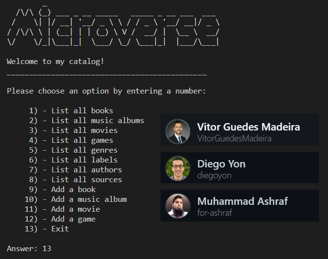

# Catalog of my things (Ruby group capstone) 📚🎶🎞️👾
 
> Catalog-of-my-things is a console app that displays all the owned items of a user. It uses json files to store data, allows the user to list "Books, Musics, Movies and Games" and add new items to it's catalog. The whole project is based on the UML diagram below:



## Built With

- [x] Ruby (programming language)
- [x] Linters: [Rubocop](https://rubocop.org/)
- [x] Visual Studio Code (code editor)
- [x] RSpec (testings) 

## Getting Started

To get a local copy up and running follow these simple steps.

### Prerequisites

- [x] A web browser like Google Chrome.
- [x] A code editor like Visual Studio Code with Git and Ruby.

You can check if Git is installed by running the following command in the terminal.
```
$ git --version
```

Likewise for Ruby installation.
```
$ ruby --version && irb
```

### Setup

Clone the repository using the GitHub link provided below.

### Install

In the terminal, go to your file directory and run this command.

```
$ git clone https://github.com/VitorGuedesMadeira/Capstone-Ruby.git
```
```
$ cd Capstone-Ruby
```
```
$ bundle install
```
```
$ code .
```

### Run tests

To install rspec, in the terminal kindly run this command

```
$ gem install rspec
```

To run tests, please run this command

```
$ rspec ./spec/#{filename}_spec.rb
```

### Usage

Kindly modify the files as needed.

## Authors

👤 **Diego Yon**
- GitHub: [@diegoyon](https://github.com/diegoyon)
- Twitter: [@diegoyon](https://twitter.com/diegoyon)
- LinkedIn: [Diego Yon](https://www.linkedin.com/in/diego-yon/)

👤 **Vitor Guedes Madeira**
- GitHub: [@vitorguedesmadeira](https://github.com/VitorGuedesMadeira)
- Twitter: [@CDahguedes](https://twitter.com/CDahguedes)
- LinkedIn: [Vitor Guedes](https://www.linkedin.com/in/vitor-guedes-madeira/)

👤 **Muhammad Ashraf Siddiqui** 🧑🏻‍💻
- GitHub: [@for-ashraf](https://github.com/for-ashraf)
- Twitter: [@forashraf](https://twitter.com/forashraf)
- LinkedIn: [Muhammad Ashraf](https://www.linkedin.com/in/muhammad-ashraf-30031439/)

## 🤝 Contributing

Contributions, issues, and feature requests are welcome!

Feel free to check the [issues page](hhttps://github.com/VitorGuedesMadeira/Capstone-Ruby/issues).

## Show your support

Give a ⭐️ if you like this project!

## Acknowledgments

- [Microverse](https://www.microverse.org/)
- Coding Partners
- Code Reviewers

## 📝 License

This project is [MIT](./MIT.md) licensed.

## UML Diagram

